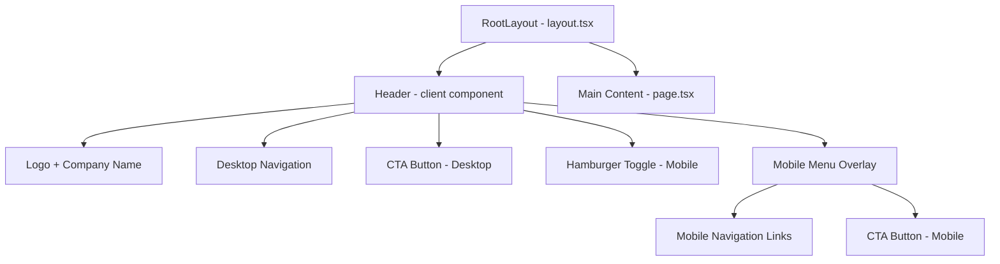

# Design Document: Portfolio Header

## Overview

This design describes the implementation of a sticky, responsive header component for the Kestrel portfolio single-page application. The header provides brand identity (logo + company name), navigation links that smooth-scroll to page sections, and a call-to-action button. On mobile viewports (below 768px), the navigation collapses into a hamburger menu with animated icon transitions and focus management for accessibility.

The implementation uses Next.js App Router with a client component (`'use client'`) for the header since it requires interactive state (mobile menu toggle). Tailwind CSS handles all styling. Phosphor Icons provides the hamburger/close icons.

## Architecture



**Key Architectural Decisions:**

1. **Client component for Header**: The header requires `useState` for the mobile menu toggle and event handlers for smooth scrolling, so it must be a client component. This is isolated from the page content which remains a server component.

2. **Single Header component file**: All header logic lives in `src/components/Header.tsx`. The header is small enough to avoid splitting into sub-components, keeping it simple and co-located.

3. **Tailwind CSS only**: All styling uses Tailwind utility classes following mobile-first responsive design. Custom colors are defined inline via arbitrary values (e.g., `bg-[#0E0C0A]`).

4. **Phosphor Icons**: Used for the hamburger (`List`) and close (`X`) icons, matching the requirement to use Phosphor Icons.

5. **Smooth scroll via CSS**: The `scroll-behavior: smooth` CSS property on the `<html>` element handles smooth scrolling when navigation links with `href="#section-id"` are clicked, avoiding unnecessary JavaScript.

## Components and Interfaces

### Header Component

**File:** `src/components/Header.tsx`

```typescript
'use client';

interface NavLink {
  label: string;
  href: string;  // anchor id e.g., "#about"
}

const NAV_LINKS: NavLink[] = [
  { label: 'About', href: '#about' },
  { label: 'Services', href: '#services' },
  { label: 'Portfolio', href: '#portfolio' },
  { label: 'Contact', href: '#contact' },
];
```

**State:**
- `isMenuOpen: boolean` — controls mobile menu visibility

**Behavior:**
- Renders sticky at the top of the viewport (`sticky top-0 z-50`)
- On desktop (≥768px): displays logo, nav links in a horizontal row, and CTA button
- On mobile (<768px): displays logo and hamburger icon; toggle opens a dropdown menu with nav links and CTA button
- Clicking a nav link smooth-scrolls to the target section and closes the mobile menu if open
- Focus management: when mobile menu opens, focus moves to the first nav link; when it closes, focus returns to the toggle button

**Props:** None (uses hardcoded nav links as constants)

### Integration Point

The Header component is rendered inside `src/app/layout.tsx`, positioned before the `{children}` content so it appears at the top of every page.

## Data Models

This feature has no persistent data models. All data is static and hardcoded:

| Data | Type | Value |
|------|------|-------|
| Company name | `string` | `"KESTREL"` |
| Logo path | `string` | `"/kestrel.svg"` |
| Nav links | `NavLink[]` | Static array of section anchors |
| CTA text | `string` | `"Start a project"` |
| CTA target | `string` | `"#contact"` |

### Design Tokens (Colors)

| Token | Hex | Usage |
|-------|-----|-------|
| Header background | `#0E0C0A` | Header `<header>` background |
| Company name color | `#D7D2C9` | "KESTREL" text |
| Nav link color | `#7B6E63` | Navigation link default state |
| Accent color | `#C9A84C` | Hover underline, CTA button bg, hamburger icon |
| CTA text color | `#0E0C0A` | Button text (matches header bg) |

## Error Handling

This component has minimal error surface since all data is static and hardcoded. Error scenarios are limited to:

1. **Missing logo file**: If `/kestrel.svg` fails to load, the `next/image` component will render the `alt` text as fallback. No runtime error is thrown.

2. **Scroll target missing**: If a nav link points to a section ID that doesn't exist yet (e.g., `#portfolio` before that section is implemented), the browser simply does nothing on click. No crash occurs — links gracefully degrade.

3. **JavaScript disabled**: The header renders with SSR. Desktop navigation works without JavaScript (links are standard `<a>` anchors). The mobile hamburger menu will not function without JavaScript, which is an acceptable progressive enhancement tradeoff for a portfolio site.

## Testing Strategy

### Why Property-Based Testing Does NOT Apply

This feature is a UI component with:
- Static, hardcoded data (no variable input space)
- DOM rendering and visual layout concerns
- Binary interactive state (menu open/closed)
- No parsers, serializers, data transformations, or algorithms

There are no meaningful "for all inputs X, property P(X) holds" statements to write. The acceptance criteria are best validated through example-based component tests and accessibility checks.

### Recommended Testing Approach

**Component Tests (React Testing Library + Jest/Vitest):**

| Test | Validates |
|------|-----------|
| Renders `<header>` element with correct background | Req 2.1, 2.6 |
| Displays company name "KESTREL" | Req 2.2, 2.13 |
| Renders company logo from `/kestrel.svg` | Req 2.14 |
| Shows nav links on desktop viewport | Req 3.1, 3.3 |
| Hides nav links on mobile viewport | Req 3.4 |
| Hamburger button toggles mobile menu | Req 2.8, 3.5 |
| `aria-expanded` updates on toggle | Req 4.3 |
| Focus moves to first nav link on menu open | Req 4.5 |
| Focus returns to toggle button on menu close | Req 4.5 |
| Nav element has `aria-label` | Req 4.1 |
| All interactive elements are keyboard accessible | Req 4.2 |
| "Start a project" button has correct colors | Req 2.11 |
| Nav links have hover underline style | Req 2.15 |

**Accessibility Audit:**
- Run axe-core in component tests to check WCAG AA contrast (Req 4.4)
- Verify tab order is logical (Req 4.2)

**Visual/Manual Testing:**
- Verify sticky positioning during scroll (Req 2.3)
- Verify smooth scroll behavior (Req 3.2)
- Verify responsive breakpoint at 768px (Req 2.4)
- Verify hamburger icon transitions to X (Req 2.10)

### Test Setup

The project currently has no test runner configured. The recommended setup is:
- **Vitest** as the test runner (fast, Vite-native, works well with Next.js)
- **React Testing Library** for component tests
- **@axe-core/react** or `jest-axe` for accessibility assertions
- Tests located in `src/components/__tests__/Header.test.tsx`

