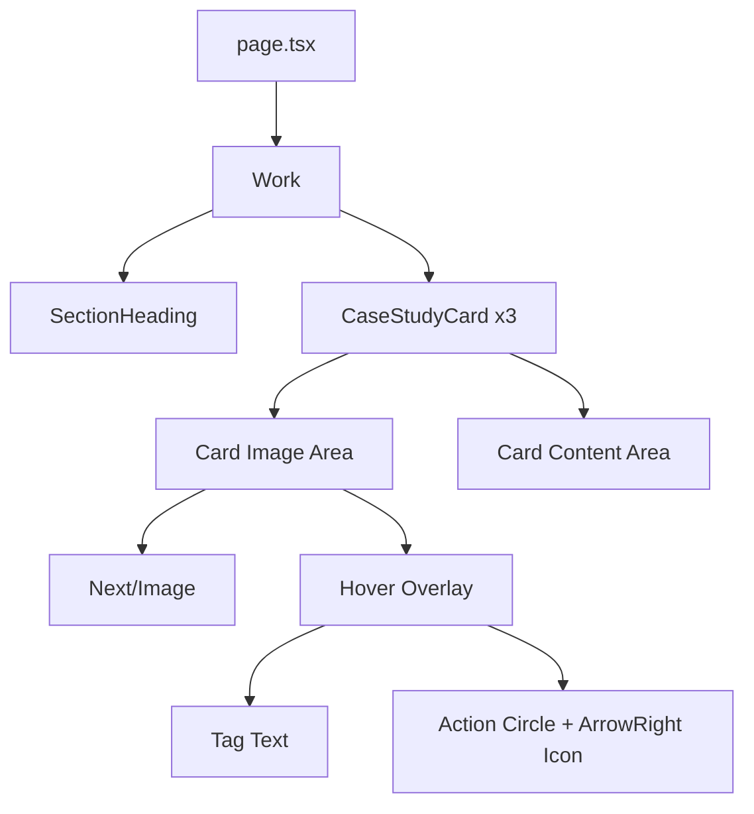

# Design Document: Portfolio Work Section

## Overview

The "Selected Work" section is a Server Component that renders three case study cards in a responsive grid. It follows the same architecture as the existing `Services` and `Process` sections: a `<section>` wrapper with the shared `SectionHeading` component, followed by a grid of cards.

The component is entirely static — all card data is defined as a constant array. No client-side state or interactivity logic is needed at the component level. Hover effects and focus indicators are handled purely through CSS (Tailwind classes and `group` utilities), keeping the component as a Server Component.

## Architecture



The `Work` component is imported and rendered in `page.tsx` between `Process` and the `about` section placeholder. It delegates heading rendering to the existing `SectionHeading` component.

**Key design decisions:**

1. **Single file component** — The `Work` component and its card rendering live in one file (`Work.tsx`), consistent with `Services.tsx` and `Process.tsx`. No separate `CaseStudyCard` component file is needed since the card is only used here and is simple enough to inline.
2. **Server Component** — No `'use client'` directive. Hover/focus states use CSS-only techniques (`group-hover`, `group-focus-visible`).
3. **CSS-only interactivity** — The hover overlay and image zoom use Tailwind's `group-hover:` and `group-focus-visible:` variants, avoiding JavaScript event handlers entirely. This makes keyboard focus expose the same overlay as mouse hover (Requirement 8.3).
4. **Anchor wrapper for cards** — Each card is wrapped in an `<a>` element (linking to a future case study page or `#`) styled as an `<article>`. This makes the entire card keyboard-focusable and exposes the hover overlay on focus without extra JS.

## Components and Interfaces

### Work Component

```typescript
// src/components/Work.tsx — Server Component (no 'use client')

interface CaseStudy {
  title: string;
  category: string;
  description: string;
  tags: string[];
  image: string;
  imageAlt: string;
}

const CASE_STUDIES: CaseStudy[] = [
  {
    title: 'Meridian Finance',
    category: 'Fullstack / Dashboard',
    description: '...',
    tags: ['React', 'Node.js', 'PostgreSQL'],
    image: '/work/meridian-finance.jpg',
    imageAlt: 'Meridian Finance dashboard interface',
  },
  {
    title: 'Sola Health',
    category: 'Web Design / SaaS',
    description: '...',
    tags: ['Next.js', 'Tailwind', 'Stripe'],
    image: '/work/sola-health.jpg',
    imageAlt: 'Sola Health platform overview',
  },
  {
    title: 'Apex Logistics',
    category: 'Custom Application',
    description: '...',
    tags: ['TypeScript', 'AWS', 'Real-time'],
    image: '/work/apex-logistics.jpg',
    imageAlt: 'Apex Logistics tracking application',
  },
];
```

### Exported API

```typescript
export const Work: () => JSX.Element;
```

Named export, consistent with `Services`, `Process`, `Hero`.

### Dependencies

| Import | Source | Purpose |
|--------|--------|---------|
| `Image` | `next/image` | Optimized image rendering with `fill` prop |
| `ArrowRightIcon` | `@phosphor-icons/react/dist/ssr` | SSR-safe icon inside the action circle |
| `SectionHeading` | `./SectionHeading` | Reusable heading with label/title/highlight |

## Data Models

### CaseStudy Interface

| Field | Type | Description |
|-------|------|-------------|
| `title` | `string` | Project name displayed as card heading |
| `category` | `string` | Category label (e.g., "Fullstack / Dashboard") |
| `description` | `string` | Short project description |
| `tags` | `string[]` | Technology/topic tags shown in hover overlay |
| `image` | `string` | Path to project image in `/public/work/` |
| `imageAlt` | `string` | Accessible alt text for the image (≤125 chars) |

Data is hardcoded as a module-level constant (`CASE_STUDIES`). No external data fetching required.

## Error Handling

| Scenario | Handling |
|----------|----------|
| Image fails to load | The `Card_Image_Area` container has explicit dimensions via `h-[70%]` and `relative` positioning. If the image fails, the container retains its size — the card layout does not collapse. A `bg-[#1A1710]` fallback background is applied to the image container. |
| Missing data fields | Not applicable — data is a compile-time constant. TypeScript enforces all fields are populated. |

## Correctness Properties

This feature renders static data with CSS-only interactivity. No pure functions, algorithms, or transformations exist that would benefit from property-based testing. The correctness properties are expressed as structural invariants verified by example-based tests.

### Property 1: Card Count Invariant

The Work section always renders exactly `CASE_STUDIES.length` cards (currently 3). The number of rendered `<article>` elements equals the length of the data array.

**Validates: Requirements 6.1**

### Property 2: Content Completeness

Every rendered card displays all required fields (category, title, description, image, tag) from its data source. No field is empty or missing in the rendered output.

**Validates: Requirements 6.2, 6.3, 6.4, 6.5**

### Property 3: Semantic Structure

Each card is wrapped in an `<article>` within a labeled `<section>`, maintaining accessible DOM hierarchy. The section has an accessible name and each card is a landmark.

**Validates: Requirements 8.1, 8.2**

### Property 4: Image Containment

Images fill their container without distortion (`object-fit: cover`) and the container never collapses to zero height regardless of image load state.

**Validates: Requirements 7.3, 7.4, 7.5**

### Property 5: Keyboard Parity

Any visual state accessible via mouse hover is equally accessible via keyboard focus. The overlay and zoom effect trigger on both `group-hover` and `group-focus-visible`.

**Validates: Requirements 8.3, 8.4**

## Testing Strategy

### Why Property-Based Testing Does Not Apply

This feature is UI rendering of static data. There are no pure functions with varied inputs, no serialization logic, no algorithms, and no transformation logic. The card data is a hardcoded constant, and interactivity is CSS-only. Example-based unit tests and accessibility audits are the appropriate testing approach.

### Unit Tests (Vitest + Testing Library)

Following the existing `Services.test.tsx` and `Services.a11y.test.tsx` patterns:

**`Work.test.tsx`** — Structural and content tests:
- Renders `<section>` with `id="work"`
- Renders SectionHeading with correct label, title, highlight
- Renders exactly 3 case study cards as `<article>` elements
- Each card displays its category, title, and description
- Each card image has a non-empty alt attribute containing the project name
- Tags are rendered for each card

**`Work.a11y.test.tsx`** — Accessibility audit:
- Section has an accessible label (`aria-labelledby`)
- Cards use semantic `<article>` elements
- Focus indicators are present (visible focus ring class)
- No axe-core WCAG AA violations

### Manual Verification

- Hover effect triggers image scale and overlay on mouse enter
- Keyboard Tab navigates to each card and triggers visible focus + overlay
- Responsive layout switches from 1-column to 3-column at `md` breakpoint
- Images render with `object-fit: cover` and no distortion

